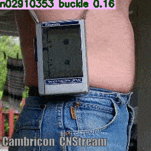
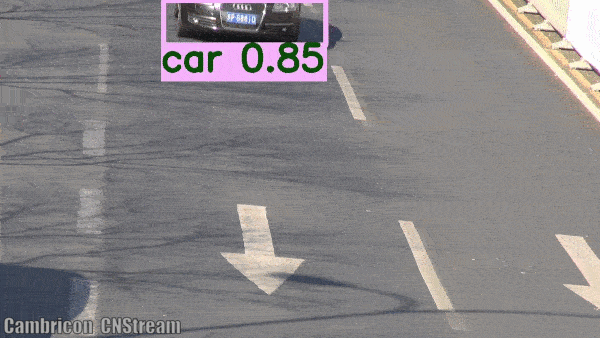
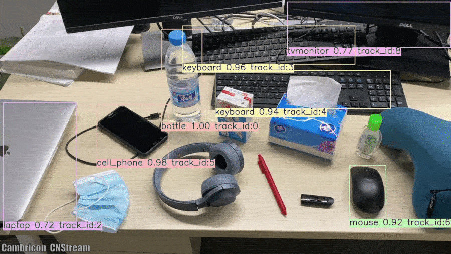
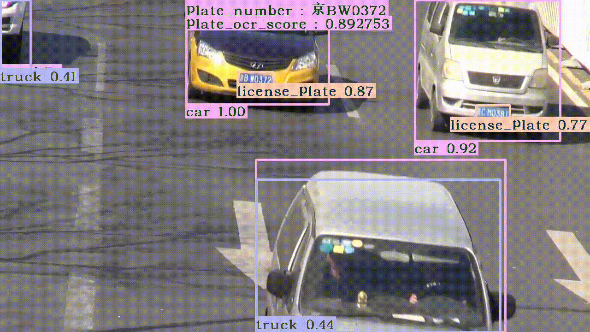

# Cambricon CNStream #
CNStream is a streaming framework with plug-ins. It is used to connect other modules, includes basic functionalities, libraries,
and essential elements.

CNStream provides the following built-in modules:

- source: Support RTSP, video file,  images and elementary stream in memory （H.264, H.265, and JPEG decoding）.
- inference: MLU-based inference accelerator for detection and classification.
- inference2: Based on infer server to run inference, preprocessing and postprocessing.
- osd (On-screen display): Module for highlighting objects and text overlay.
- encode: Encode videos or images.
- display: Display the video on screen.
- tracker: Multi-object tracking.
- rtsp_sink：Push RTSP stream to internet.

### Getting started ###

  To start using CNStream, please refer to the chapter of ***quick start*** in the document of Cambricon-CNStream-User-Guild-CN.pdf.
## Samples ##

|                        Classification                        |               Object Detection                |
| :----------------------------------------------------------: | :-------------------------------------------: |
|  |  |

|               Object Tracking               |               License plate recognization               |
| :-----------------------------------------: | :-----------------------------------------------------: |
|  |  |

|                           Body Pose                          |               Vehicle Detection               |
| :----------------------------------------------------------: | :-----------------------------------------: |
|  |  |

## Best Practices ##

### **How to build a classic classification or detection application based on CNStream?** ###

You should find a sample from ``samples/simple_run_pipeline/simple_run_pipeline.cpp`` that helps developers easily understand how to develop a classic classification or detection application based on CNStream pipeline.

This sample supports typical classification and detection neural networks like vgg resnet ssd fasterrcnn yolo-vx and so on.

This sample supports images or video file as input.

### **How to change the input video file?** ##

Modify the `files.list_video` file, which is under the `samples` directory, to replace the video path. Each line represents one stream. It is recommended to use an absolute path or use a relative path relative to the executor path.

## Documentation ##
[Cambricon Forum Docs](https://www.cambricon.com/docs/cnstream/user_guide_html/index.html)

Check out the Examples page for tutorials on how to use CNStream. Concepts page for basic definitions.

## Community forum ##
[Discuss](http://forum.cambricon.com/list-47-1.html) - General community discussion around CNStream.
