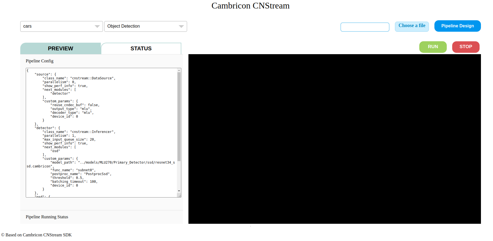
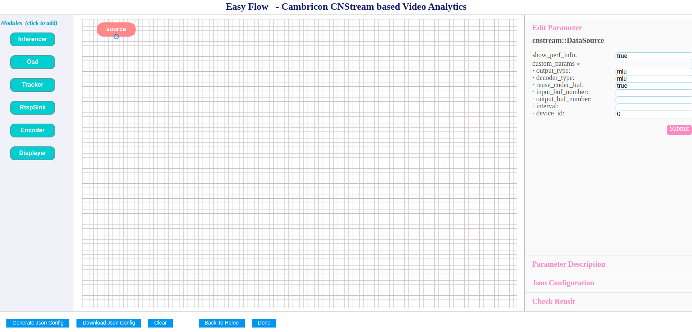

web可视化工具
==============

Web可视化工具提供了图形化界面设计、配置和运行pipeline，并能够直观地查看运行输出结果。从而帮助用户快速体验寒武纪数据流分析框架。

   Web可视化工具主页面

功能介绍
----------

web可视化工具主要提供以下功能：

- 图形化界面设计和配置pipeline：

  * 提供内置的pipeline示例配置，用户可以直接运行示例，快速体验如何使用CNStream开发应用。
  * 支持在线设计和配置pipeline。提供内置模块的流程块，支持像绘制流程图一样在web端绘制pipeline，拖动表示模块的流程块至设计框，并通过连线连接数据流向。
   
    * 支持修改模块参数配置。
    * 提供pipeline配置正确性自动检测，包括基本的模块参数配置和流程图的环自动检测。
    * 流程图绘制完成后，可以通过下载为JSON文件或者跳转至主页面运行或预览。
  
- 支持部分数据源选用和上传：

  * 默认支持cars、people、images三种类型的数据源。
  * 支持上传视频文件为数据源。

- 支持preview和status两种模式运行pipeline。

  * PREVIEW模式下运行pipeline，可以预览运行的视频结果。
  * Status模式下运行pipeline，会显示pipeline运行的状态，显示运行的fps、latency等信息。

首次使用前部署与设置
----------------------

Web可视化工具使用前，执行下面步骤完成部署和配置：

1. 在 ``${CNSTREAM_DIR}/tools/web_visualize`` 目录下执行下面脚本，配置需要的环境。其中 ``${CNSTREAM_DIR}`` 代表CNStream源码目录。

   ::
   
     ./prerequired.sh
	 
2. 在 ``${CNSTREAM_DIR}/CMakeLists.txt`` 文件中打开Web可视化功能。 

   ::
   
     option(with_web_visualize "build web visualize" ON)

3. 编译cnstream。在 ``${CNSTREAM_DIR}/build`` 目录下运行下面命令：

   ::
   
     make
	 
4. 在 ``${CNSTREAM_DIR}/tools/web_visualize`` 目录下执行下面脚本来运行web可视化工具。

   ::
   
     ./run_web_visualize.sh

5. web可视化工具启动后，根据屏幕上会显示“Listening at:”字段。根据该字段的IP地址和端口号打开浏览器访问web可视化工具。例如：

   ::
   
     [2020-09-08 17:39:31 +0800] [34621] [INFO] Listening at: http://0.0.0.0:9099 (34621)

Pipeline的设计和配置
---------------------

Web可视化工具提供可视化的界面帮助用户快速搭建pipeline。用户只需拖拽内置模块，并关联模块，即可完成pipeline的搭建。

Pipeline的设计页面如下所示：

   Pipeline设计页面

.. _设计pipeline:

设计和配置pipeline
>>>>>>>>>>>>>>>>>>>>

执行下面步骤完成pipeline设计：

1. 在web可视化工具主页面，点击 **Pipeline Design** 按钮。进入Pipeline设计页面。
2. 单击页面最左边想要添加的模块名，模块会添加到pipeline设计框。
3. 在pipeline设计框中单击上一步添加的模块，页面最右边“Edit Parameter”中，输入该模块的配置参数。在“Parameter Description”中可以查看该模块的参数设置。
4. 在pipeline设计框中连接各模块。
 
根据用户设计，相对应的JSON配置文件会自动生成。用户可以在页面最右边“Json Configuration”中可以查看JSON配置文件。Web可视化工具会自动检测pipeline和各模块配置是否正确并在“Check Result”中查看配置是否成功。

配置完成后，用户可以 运行自定义pipeline_ 查看运行结果。

.. attention::
   | 如果想要使用Preview模式运行pipeline后做数据的预览，由于数据预览需要同步数据，所以pipeline设计的末端只能有一个节点，即末端必须为汇聚节点。
  
生成和下载JSON配置文件
>>>>>>>>>>>>>>>>>>>>>>>>

pipeline设计完成后，Web可视化工具会自动生成对应的JSON配置文件。用户通过点击Pipeline设计页面下的 **Generate Json Config** 按钮生成JSON配置文件。并点击 **Download Json Config** 按钮下载配置文件。

运行内置的pipeline示例
--------------------------

Web可视化工具提供了pipeline示例，用户可以直接运行示例，并直接在页面查看运行结果。

1. 在web可视化工具主页面，从下拉菜单中选择数据源类型。目前支持cars、people、images三种类型的数据源。
2. 在下拉菜单中选择任务类型类型，目前提供以下一种示例：Classification、Object Detection、Object Tracking、Secondary Classification。
3. 选择Preview或者Status标签。
4. 点击 **RUN** 按钮。

如果选择Preview模式，页面会在“Pipeline Config”中显示示例对应的JSON配置文件内容，并在右边显示输出的视频。
如果选择Status模式，页面会在“Pipeline Config”中显示示例对应的JSON配置文件内容，并在“Pipeline Running Status”中显示运行的fps、latency等信息。

.. _运行自定义pipeline:

运行自定义pipeline
----------------------

用户可以通过Web可视化工具运行已设计的pipeline。

1. pipeline设计完成后，点击Pipeline设计页面下的 **Done** 按钮。返回到Web可视化工具主页面。有关如何设计pipeline，查看 设计pipeline_。
2. 上传数据源。点击 **Choose a file** 按钮选择数据源文件。目前只支持视频文件。
3. 选择Preview或者Status标签。
4. 点击 **RUN** 按钮。

如果选择Preview模式，页面会在“Pipeline Config”中显示示例对应的JSON配置文件内容，并在右边显示输出的视频。
如果选择Status模式，页面会在“Pipeline Config”中显示示例对应的JSON配置文件内容，并在“Pipeline Running Status”中显示运行的fps、latency等信息。
