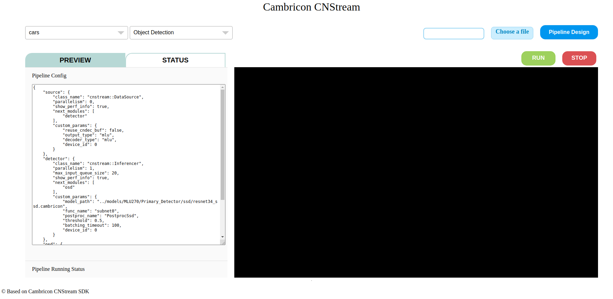
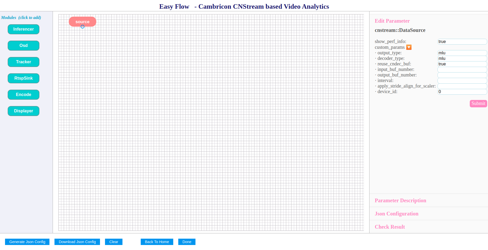

#### web可视化工具

##### 编译使用方式

1. 在cnstream/tools/web_visualize目录下执行prerequired.sh脚本，配置需要的环境
2. cnstream/CMakeLists.txt中打开with_web_visualize开关，编译cnstream
3. 在cnstream/tools/web_visualize目录下执行./run_web_visualize.sh脚本，运行webserver，根据给出的ip和端口号访问web端（webserver运行起来后，“Listening at:”字段给出）

##### 功能简介

**web可视化主页功能一览：**

- web可视化工具主要提供的功能：
  - 支持选用或设计pipeline配置：
    - 提供一些内置的pipeline demo配置
    - 支持在线design pipeline配置（web主页面点击右上角的“Pipeline Design”进入）
  - 支持部分数据源选用和上传
    - home页面上依次给出cars/people/images/objects四种类型的数据源
    - “Choose a file”按钮支持上传视频文件
  - 选择好数据和pipeline配置后，支持运行pipeline,通过RUN和STOP按钮控制开始运行和结束：
    - “PREVIEW”tab页下执行RUN/STOP操作，运行pipeline并在网页端渲染pipeline输出的视频（针对自行设计的pipeline配置，需要pipeline的end节点为汇聚节点）

**pipeline design页面功能一览：**

- web端design pipeline主要提供以下功能：
  - 提供内置插件的流程块，支持像绘制流程图一样在web端绘制pipeline，点击选择表示插件的流程块（在页面上可拖动），并通过连线连接数据流向；
  - 插件参数可以修改配置：选中插件，在右侧边栏的中修改并点击submit保存；
  - 提供pipeline配置正确性检测：包括基本的插件参数配置和流程图的环检测（自动执行）；
  - 流程图绘制完成后，可以通过download下载为json文件或者点击Done跳转至主页面运行或预览。
